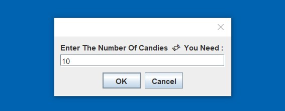
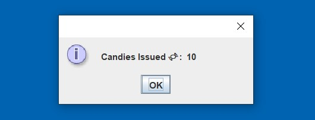
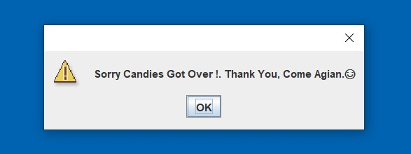

# CandyMachine 🍬🎫🍬 

### WorkFlow Of Candy Machine: 

 

1. Required No.Of Candies Is Entered By The User  :

2. The Candy Machine Returns The Specfied No.Of Candies To The User :

3. In Case, If The Stock Of Candies Gets Over, Then It Prompts A Message To The User : 

 
