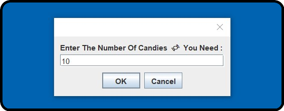
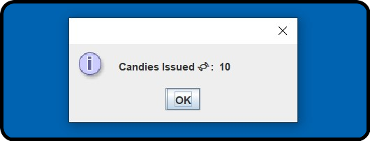

<h1 align="center">Candy Machine 🍬</h1> 

<h3>WorkFlow Of Candy Machine : ⤵</h3> 

 

1.`Required No.Of Candies Is Entered By The User  :`

  

  

2. `The Candy Machine Returns The Specfied No.Of Candies To The User :`

  

 

3. `In case, If the stock of candies gets over, Then it will prompt the user to visit again later` 
 
