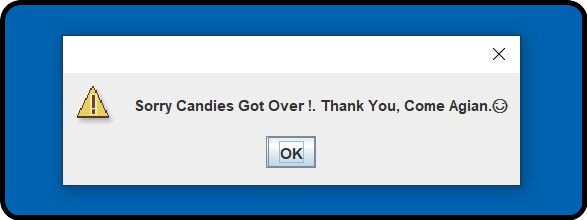

# CandyMachine 🍬🎫🍬 

<b>WorkFlow Of Candy Machine:
 

 

1.`Required No.Of Candies Is Entered By The User  :`

  

  

2. `The Candy Machine Returns The Specfied No.Of Candies To The User :`

  

 

3. `In Case, If The Stock Of Candies Gets Over, Then It Prompts A Message To The User :` 

  

 

 
