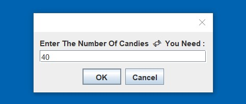
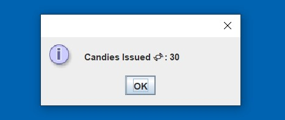
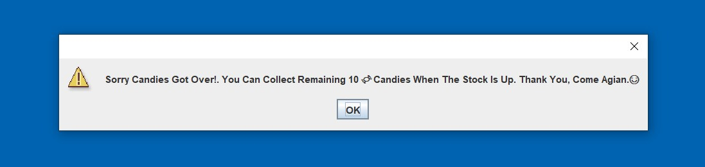

# CandyMachine 🍬🎫🍬 

### WorkFlow Of Candy Machine: 

 

1. Required No.Of Candies Is Entered By The User  :

2. The Candy Machine Returns The Specfied No.Of Candies To The User :

3. In Case, If The Stock Of Candies Gets Over, Then It Prompts A Message To The User : 

 

## Special Case :

#### If The User Enters The Required No.Of Candies(More Than The Total Stock) In Initial Attempt Only : 

   ◾ It Returns The Total No.Of Candies That The Machine Currently Has And Prompts A Message To User.

 
 
 ---
 
 
  
 ---
  
 
